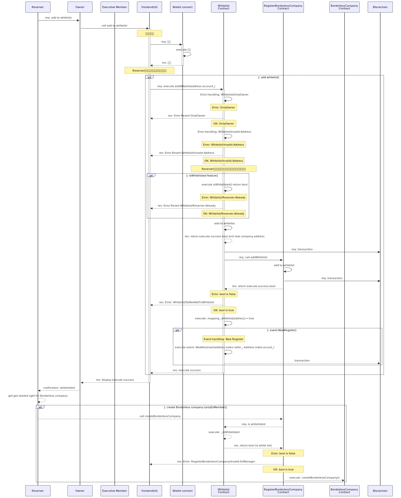

## Overview

- Borderless Company = 合同会社型 DAO（DAO-LLC-JP）の`予約契約`をするコントラクトのドキュメントです。

1. `Contracts` 対象となるコントラクトを記載します
2. `Diagrams` シーケンス図など記載をします
3. `Issue` 課題について記載をします
4. `Others` その他の内容を記載します

---

## Contracts

1. Reserve.sol

- Operations

1. Borderless.company を起動（設立）するアクターの予約者の登録・管理をする
2. Borderless.company を起動（設立）の予約者であるか確認をする
3. **機能検討中** Borderless.company を起動（設立）の予約者の登録解除をする。

- 補足

本コントラクトは、`RegisterBorderlessCompany`で、`createBorderlessCompany`を実行するアクセスコントロールのための機能を提供するために作成しています。

---

## Diagrams

1. Data structure
2. Class
3. interfaces
4. Sequence

---

### 1. Data structure

- Data storage

```solidity
address private _owner;
uint256 private _lastIndex;
mapping(uint256 index_ => address account_) private _reservers;
mapping(address account_ => bool listed_) private _whitelist;
```

---

### 2. Class

- Actor
  1. `Reserver` is Executive member(`ExMember`)
  2. `Owner` is smart contract owner (Overlay)
  3. Smart contract
     1. `Reserve` has a add to whitelist and check whitelist feature
     2. `RegisterBorderlessCompany` has a `createBorderlessCompany` feature

---

- class diagram



<details>
<summary>mermaid code</summary>
        ```mermaid
        classDiagram
            Reserver ..|> Owner: 1. request add to whitelist
            Owner ..|> Reserve: 2. add to whitelist
            Reserve ..|> IReserve: implement
            IReserve ..|> RegisterBorderlessCompany
            Reserver ..|> ExMember: 3. get-started right for Borderless Company
            ExMember ..|> IRegisterBorderlessCompany: 4. call create Borderless Company
            RegisterBorderlessCompany ..|> IRegisterBorderlessCompany: implement
            RegisterBorderlessCompany ..|> IReserve: 5. call _isWhitelisted

            class Owner
            class Reserver

            class IReserve {
                <<interface>>
                +reservation(address account_) returns(bool)
                +isWhitelisted(address account_) returns(bool)
                +cancel(address account_) returns(bool);
            }

            class Reserve{
                -address _owner
                -uint256 _lastIndex
                -mapping uint256 index_ => address account_ _reservers
                -mapping address account_ => bool listed_ _whitelist
                +reservation(address account_) returns(bool)
                +isWhitelisted(address account_) returns(bool)
                +cancel(address account_) returns(bool);
                -_addWhitelist(address account_) returns(bool)
                -_isWhitelisted() returns(bool)
                -_removeWhitelist(address account_) returns(bool);
                -onlyOwner()
            }

            class IRegisterBorderlessCompany{
                <<interface>>
                -address _owner
                +createBorderlessCompany(CompanyInfo companyInfo_)
                -onlyExmember()
            }

            class RegisterBorderlessCompany{
                -address _owner
                +createBorderlessCompany(CompanyInfo companyInfo_)
                -onlyExmember()
            }
    ````

</details>

---

### 3. Interfaces

- feature interface

```solidity
    /**
    * @dev ホワイトリストにアカウントを追加する外部公開関数
    * @notice オーナーのみがこの関数を呼び出せます
    * - onlyOwner モディファイアを使用して、オーナーのみがこの関数を呼び出せるようにします
    * @param account_ 追加するアカウントのアドレス
    * @return listed_ アカウントがリストに追加されたかどうかのブール値
    */
    function reservation(address account_) external onlyOwner returns(bool listed_);

    /**
    * @dev 指定されたアカウントがホワイトリストに含まれているかを確認する外部公開関数
    * @notice オーナーのみがこの関数を呼び出せます
    * - onlyOwner モディファイアを使用して、オーナーのみがこの関数を呼び出せるようにします
    * @param account_ 確認するアカウントのアドレス
    * @return listed_ アカウントがリストに含まれているかどうかのブール値
    */
    function isWhitelisted(address account_) external onlyOwner returns(bool listed_);

    /**
    * @dev 現在のコントラクトのコンテキストで、呼び出し元のアカウントがホワイトリストに含まれているかを確認する外部公開関数
    * @return listed_ アカウントがリストに含まれているかどうかのブール値
    */
    function isWhitelisted() external returns(bool listed_);

    /**
    * @dev 指定されたアカウントをホワイトリストから解除する関数
    * @notice オーナーのみがこの関数を呼び出せます
    * @param account_ 予約解除するアカウントのアドレス
    * @return listed_ アカウントがリストに含まれているかどうかのブール値
    */
    function cancel(address account_) external onlyOwner returns(bool listed_);

    /**
    * @dev 予約者数のインデックスを取得するための関数
    * @return index_ 予約者のインデックスです。
    */
    function lastIndexOf() external onlyOwner returns(uint256 index_);

    /**
    * @dev 予約者のアドレスを取得するための関数
    * @notice オーナーのみがこの関数を呼び出せます
    * @return reserver_ 予約者のアドレスです。
    */
    function reserverOf(uint256 index_) external onlyOwner returns(address reserver_);

    /**
    * @dev 全予約者のアドレスを取得するための関数です。
    * @notice オーナーのみがこの関数を呼び出せます
    * @return reservers_ 予約者のアドレスの配列です。
    */
    function reserversOf() external onlyOwner returns(address[] reservers_);
```

---

- addToWhitelist

```json
// request

{
    "account_": "0x...."
}

// response

{
    "listed_": true
}
```

---

- isWhitelisted

```json
// request

{
    "account_": "0x...."
}

// response

{
    "listed_": true
}
```

---

- removeWhitelist

```json
// request

{
    "account_": "0x...."
}

// response

{
    "listed_": true
}
```

---

- lastIndexOf

```json
// request

{
    // empty
}

// response

{
    "index_": 10
}
```

---

- reserverOf

```json
// request

{
    "index" : 1
}

// response

{
    "reserver_": "0x..."
}
```

---

- reserversOf

```json
// request

{
    // empty
}

// response

{
    "reservers_": ["0x...", "0x...", "0x..."]
}
```

---

- Event-handling

1. `NewReserver(address index caller_, address index account_)` 新規予約者の登録イベントを発行する
2. `CancelReserver(address index caller_, address index account_)` 予約者の解除イベントを発行する

```solidity
    /**
    * @dev 新しい予約契約者が追加されたときに発生するイベント
    * @param caller_ イベントを発生させた呼び出し元のアドレス
    * @param account_ 新しく予約されたアカウントのアドレス
    */
    event NewReserver(address indexed caller_, address indexed account_);

    /**
    * @dev 予約契約がキャンセルされたときに発生するイベント
    * @param caller_ イベントを発生させた呼び出し元のアドレス
    * @param account_ 予約キャンセルしたアカウントのアドレス
    */
    event CancelReserve(address indexed caller_, address indexed account_);
```

---

- Error-handling

1. `Error: Reserve/Invalid-Address` 不正なアドレスの時はリバートする
   1. 呼び出し者のアドレスが `Null`（ゼロアドレス）ケースなど
2. `Error: Reserve/Invalid-Index` 不正なインデックスの時はリバートする
   1. インデックスが `Null`（0）ケースなど
3. `Error: Reserve/Already-Reserve` 登録済みアドレスの時はリバートする
   1. 呼び出し者のアドレスが `false`でない（whitelist へ登録済み）ケース
4. `Error: Reserve/Only-Owner` 呼び出し者が Overlay のコントラクト・オーナーアドレスでない時はリバートする
5. `Error: Reserve/DoNot-to-AddWhitelist` whitelist への登録に失敗した時はリバートする

---

```solidity
    /**
    * @dev 不正なアドレスが提供された場合に発生するエラー
    * @param account_ 無効なアドレスとして提供されたアカウント
    */
    error InvalidAddress(address account_);

    /**
    * @dev 不正なインデックスが提供された場合に発生するエラー
    * @param index_ 無効な値として提供されたインデックス値
    */
    error InvalidIndex(uint256 index_);

    /**
    * @dev 既に予約済みのアカウントが提供された場合に発生するエラー
    * @param account_ 既に予約されたアカウント
    */
    error AlreadyReserver(address account_);

    /**
    * @dev 既に予約契約なしアカウントが提供された場合に発生するエラー
    * @param account_ 予約契約がないアカウント
    */
    error AlreadyNotReserve(address account_);

    /**
    * @dev ホワイトリストにアカウントを追加できなかった場合に発生するエラー
    * @param account_ ホワイトリストに追加しようとしたが失敗したアカウント
    */
    error DoNotToAddWhitelist(address account_);

    /**
    * @dev オーナーのみが関数を実行できる修飾子
    */
    modifier onlyOwner() {
        require(msg.sender == _owner, "Error: Reserve/Only-Owner");
        _;
    }
```

---

### 3. Sequences

- sequence diagram



<details>
<summary>mermaid code</summary>
    ```mermaid
        sequenceDiagram
            participant RV as Reserver
            participant OW as Owner
            participant EM as Executive Member
            participant UI as frontend(UI)
            participant WC as Wallet connect
            participant RS as Reserve<br/>Contract
            participant RBLC as RegisterBorderlessCompany<br/>Contract
            participant BLC as BorderlessCompany<br/>Contract
            participant BC as Blockchain

            RV ->>+ OW: req: reservation
            OW ->>+ UI: call reservation

            Note over UI: 署名の実行
            UI ->>+ WC: req: 署名
            WC ->> WC: execute 署名
            WC -->>- UI: res: 承認

            Note over UI: Reserverのホワイトリスト登録の実行
            alt: reservation
            UI ->>+ RS: req: execute reservation(address account_)

            RS ->> RS: Error-handling: Reserve/Only-Owner
            Note over RS: Error: Reserve/Only-Owner
            RS -->> UI: res: Error Revert Reserve/Only-Owner
            Note over RS: OK: Reserve/Only-Owner

            RS ->> RS: Error-handling: Reserve/Invalid-Address
            Note over RS: Error: Reserve/Invalid-Address
            RS -->> UI: res: Error Revert Reserve/Invalid-Address
            Note over RS: OK: Reserve/Invalid-Address

            Note over RS: Reserverとしてホワイトリスト登録者かのチェック
            alt: isWhitelisted feature
            RS ->> RS: execute isWhitelisted() return bool

            Note over RS: Error: Reserve/Already-Reserver
            RS -->> UI: res: Error Revert Reserve/Already-Reserver
            Note over RS: OK: Reserve/Already-Reserver
            end

            RS ->> RS: _addToWhitelist
            RS -->> RS: res: return execute success
            RS ->> BC: req: transaction

            RS ->>+ RBLC: req: call addWhitelist
            RBLC ->> RBLC: add to whitelist
            RBLC ->> BC: req: transaction
            RBLC -->> RS: res: return execute success bool

            Note over RS: Error: bool is false
            RS -->> UI: res: Error: Reserve/DoNotAddToWhitelist
            Note over RS: OK: bool is true

            RS ->> RS: execute: mapping _whitelist[address] = true

            alt: event NewReserver
            Note over RS: Event-handling: NewReserver
            RS ->> RS: execute event: NewReserver(address indexed caller_, address indexed accout_)
            RS -->> BC: transaction
            end
            RS -->>- UI: res: execute success
            end
            UI -->>- OW: res: display execute success
            OW -->> RV: notification: whitelisted
            RV -->> RV: get get-started right for Borderless company

            alt: create Borderless company (onlyFounder)
            RV -->>+ RBLC: call createBorderlessCompany
            RBLC -->> RS: req: is whitelisted
            RS -->> RS: execute: _isWhitelisted

            RS -->> RBLC: res: return bool (is white list)
            Note over RBLC: Error: bool is false
            RBLC -->> UI: res: Error: Register/Only-Founder

            Note over RBLC: OK: bool is true
            RBLC -->> BLC: execute: createBorderlessCompany()
            end
        ```

</details>

---

## Issue

---

## Others

- Mermaid の SVG 変換

```linux
docker pull minlag/mermaid-cli:latest
docker run -it --rm -u "${UID}:${GID}" -v ${PWD}:/data minlag/mermaid-cli:latest -i /data/0.Reserve.index.md
```
