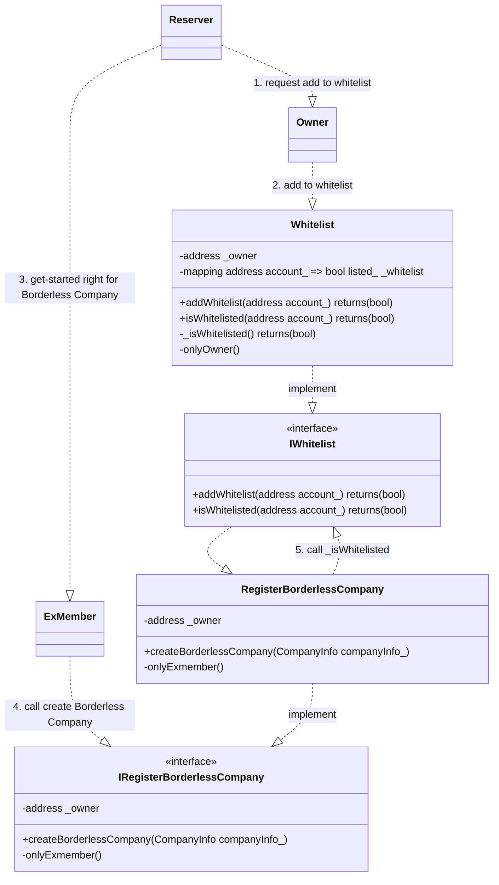
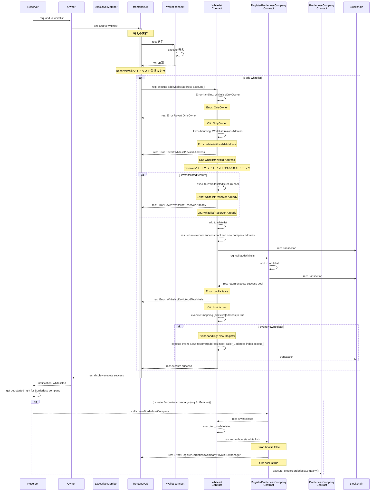

## Overview

- Borderless Company = 合同会社型 DAO（DAO-LLC-JP）の起動を`利用予約` するコントラクトのドキュメントです。

1. `Contracts` 対象となるコントラクトを記載します
2. `Diagrams` シーケンス図など記載をします
3. `Issue` 課題について記載をします
4. `Others` その他の内容を記載します

---

## Contracts

1. Whitelist.sol

- Operations

1. Borderless.company を起動（設立）するアクターの予約者の登録・管理をする
2. Borderless.company を起動（設立）の予約者であるか確認をする
3. **機能検討中** Borderless.company を起動（設立）の予約者の登録・更新をする。

- 補足

本コントラクトは、`RegisterBorderlessCompany`で、`createBorderlessCompany`を実行するアクセスコントロールのための機能を提供するために作成しています。

---

## Diagrams

1. Data structure
2. Class
3. Sequence

---

### 1. Data structure

- Data storage

```solidity
address private _owner;
mapping(address account_ => bool listed_) private _whitelist;
```

---

### 2. Class

- Actor
  1. `Reserver` is Executive member(`ExMember`)
  2. `Owner` is smart contract owner (Overlay)
  3. Smart contract
     1. `Whitelist` has a add to whitelist and check whitelist feature
     2. `RegisterBorderlessCompany` has a `createBorderlessCompany` feature

---

- class diagram



---

### 3. Sequences

1. addWhitelist(address account)
2. isWhitelisted(address account)

---

#### 1. addWhitelist(address account), 2. isWhitelisted(address account)

```solidity
// -- Whitelist登録 --//
/**
 * @dev ホワイトリストにアカウントを追加する外部公開関数
 * @notice オーナーのみがこの関数を呼び出せます
 * @param account_ 追加するアカウントのアドレス
 * @return listed_ アカウントがリストに追加されたかどうかのブール値
 */
function addToWhitelist(address account_) external onlyOwner returns(bool listed_);

/**
 * @dev ホワイトリストにアカウントを追加する内部関数
 * @param account_ 追加するアカウントのアドレス
 * @return listed_ アカウントがリストに追加されたかどうかのブール値
 */
function _addToWhitelist(address account_) internal returns(bool listed_);


// -- Reserver・ホワイトリストチェック --//
/**
 * @dev 指定されたアカウントがホワイトリストに含まれているかを確認する外部公開関数
 * @notice オーナーのみがこの関数を呼び出せます
 * @param account_ 確認するアカウントのアドレス
 * @return listed_ アカウントがリストに含まれているかどうかのブール値
 */
function isWhitelisted(address account_) external onlyOwner returns(bool listed_);

/**
 * @dev 現在のコントラクトのコンテキストで、呼び出し元のアカウントがホワイトリストに含まれているかを確認する外部公開関数
 * @return listed_ アカウントがリストに含まれているかどうかのブール値
 */
function isWhitelisted() external returns(bool listed_);

/**
 * @dev 指定されたアカウントがホワイトリストに含まれているかを確認する内部関数
 * @param account_ 確認するアカウントのアドレス
 * @return listed_ アカウントがリストに含まれているかどうかのブール値
 */
function _isWhitelisted(address account_) internal returns(bool listed_);

// -- Access control -- //
// Note: onlyExMemberは、`RegisterBorderlessCompany`であつかうため割愛


/**
 * @dev オーナーのみが関数を実行できる修飾子
 */
modifier onlyOwner() {
    require(msg.sender == _owner, "Error: Whitelist/OnlyOwner");
    _;
}

```

- addToWhitelist

```json
// request

{
    "account_": "0x...."
}

// response

{
    "listed_": true
}
```

- isWhitelisted

```json
// request

{
    "account_": "0x...."
}

// response

{
    "listed_": true
}
```

---

- Access control

1. `Reserver` 登記者・業務執行社員（代表社員）
2. `OnlyOwner` （Overlay の）コントラクト・オーナーアドレスのみが実行できること
   1. `_whitelist`への登録
      1. `Reserver`アドレスを `true` で登録する
   2. コントラクト・オーナーアドレスの変更
   3. `_whitelist`の操作
      1. `Reserver`アドレスを、`false`へ更新する
      2. `Reserver`アドレスを、`_whitelist`から削除する
3. `RegisterBorderlessCompany`は、whitelist コントラクトへ設立者の照会ができること
   1. `isWhitelisted`の操作
      1. whitelist に登録された呼び出し者であるか、`true` or `false` チェックする

---

- Error handling

1. `Error: Whitelist/Invalid-Address` 無効なアドレスの時はリバートする
   1. 呼び出し者のアドレスが `Null`（ゼロアドレス）ケース
2. `Error: Whitelist/Reserver-Already` 登録済みアドレスの時はリバートする
   1. 呼び出し者のアドレスが `false`でない（whitelist へ登録済み）ケース
3. `Error: Whitelist/OnlyOwner` 呼び出し者が Overlay のコントラクト・オーナーアドレスでない時はリバートする
4. `Error: Whitelist/DoNot-to-AddWhitelist` whitelist への登録に失敗した時はリバートする

- Error-handling feature

```solidity
// -- 1.1 Error: Whitelist/Invalid-Address -- //
error InvalidAddress(address account_);

// -- 2.1 Error: Whitelist/Reserver-Already -- //
error ReserverAlready(address account_);

// -- 3.1 Error: Whitelist/OnlyOwner -- //
// Note: onlyOwnerの中で、Requireによりリバートする

// -- 4.1 Error: Whitelist/DoNot-to-AddWhitelist -- //
error DoNotToAddWhitelist(address account_);

```

---

- Event handling

1. `NewReserver(address index caller_, address index account_)` 新規予約者の whitelist への登録イベントを発行する

```solidity
// -- 1. 新規予約者の登録イベント --//

/**
 * @dev 新しい予約者が追加されたときに発生するイベント
 * @param caller_ イベントを発生させた呼び出し元のアドレス
 * @param account_ 新しく予約されたアカウントのアドレス
 */
event NewReserver(address indexed caller_, address indexed account_);
```

---

- sequence diagram



---

## Issue

- 未実装の機能メモ
  - 今後、実装する機能リスト

1. `_whitelist`の操作
   1. `Reserver`アドレスを、`false`へ更新する
   2. `Reserver`アドレスを、`_whitelist`から削除する

---

- 検討メモ

1. 予約者をインデックスで管理するかは検討中です。※不要な機能ではないかなと。

```solidity
uint256 private _lastIndex;
mapping(uint256 index_ => address account_) private _reservers;
```

---

## Others

- Mermaid の SVG 変換

```linux
docker pull minlag/mermaid-cli:latest
docker run -it --rm -u "${UID}:${GID}" -v ${PWD}:/data minlag/mermaid-cli:latest -i /data/0.Whitelist.index.md
```
