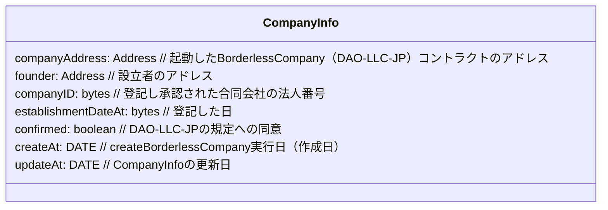
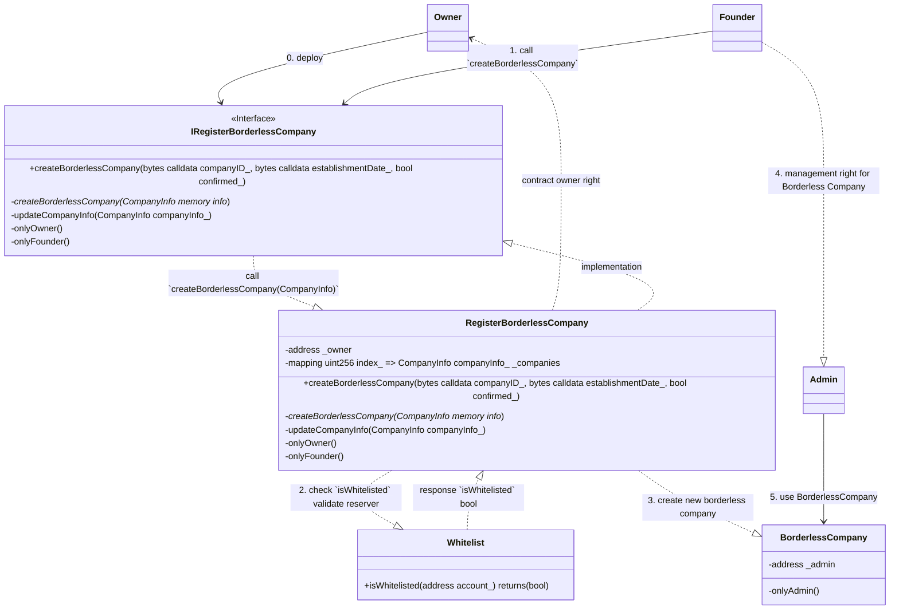
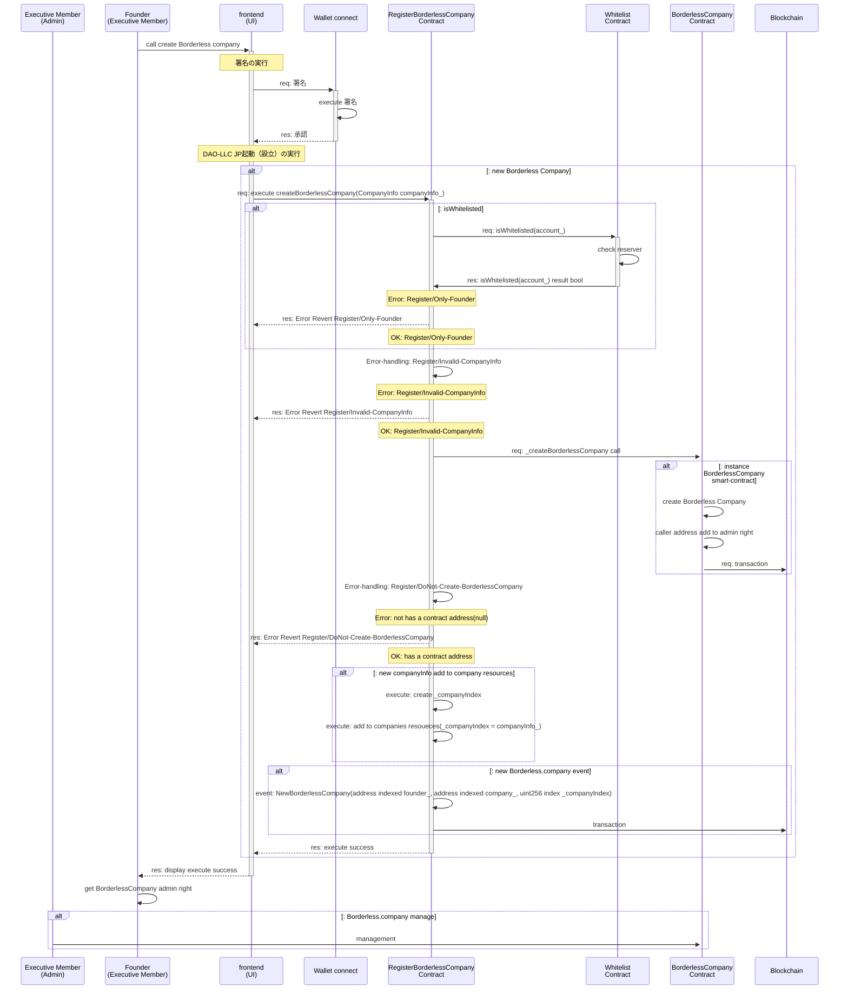

## Overview

- 登記済みの業務執行社員（代表社員）により、`1.登記した合同会社の各リソース登録`と`運営2.規定への同意`を行い、Borderless.company = 合同会社型 DAO（DAO-LLC-JP）`3.BorderlessCompany を起動する`コントラクトのドキュメントです。

1. `Contracts` 対象となるコントラクトを記載します
2. `Diagrams` シーケンス図など記載をします
3. `Issue` 課題について記載をします
4. `Others` その他の内容を記載します

---

## Contracts

1. RegisterBorderlessCompany.sol
2. BorderlessCompany.sol // 起動される `Borderless.company(DAO-LLC-JP) の機能を持つ`コントラクト

- Operations

1. 業務執行社員が Borderless.company を起動（設立）する
   1. 設立する組織リソース`CompanyInfo`を入力する
   2. 組織の規約・規定に同意する
   3. Borderless.company の起動（設立）をする
   4. `BorderlessCompany`コントラクトが起動する
2. 業務執行社員が `CompanyInfo`を更新する
3. **機能検討** `RegisterBorderlessCompanyコントラクト`を、コントラクトオーナーが管理する
   1. `RegisterBorderlessCompanyコントラクト`上で、companies の管理
      1. `companies`上からの停止・削除

`1-1,1-2` に関しては、UI 側で担う。（`1-1,1-2` で作成された）組織リソースをもとに、`1-3` により、`BorderlessCompany`の起動を行い、結果、`1-4`（`BorderlessCompany`コントラクトの起動）に至ります。

---

## Diagrams

1. Data structure
2. Class
3. Sequence

---

### 1. Data structure

- Data storage

```solidity
address private _owner;
uint256 private _lastIndex;
mapping (uint256 index_ => CompanyInfo companyInfo_) _companies;
```

---

- CompanyInfo
  - UI 側で入力された組織リソースのデータ構造を記述しています。



---

### 2. Class

- Actor
  1. `Founder` is Executive member
  2. `Owner` is smart contract owner (Overlay)
  3. `Admin` is smart contract admin for BorderlessCompany.sol
  4. Smart contract
     1. `RegisterBorderlessCompany` has a `createBorderlessCompany` feature
     2. `BorderlessCompany` has a Borderless company feature

---

- class diagram



---

### 3. Sequences

1. createBorderlessCompany feature

---

#### 1. createBorderlessCompany feature

- features
- [(参考リンク)CompanyDAO createCompany](https://github.com/CompanyDAO/protocol-contracts/blob/6ac88b2449558bbe7d694f9f0622f995105e4fe9/contracts/registry/CompaniesRegistry.sol#L80)

```solidity

// -- Borderless.companyのセットアップ --//

/**
 * @dev この関数はボーダーレス企業を作成します。
 * @param companyID_ 企業のIDです。
 * @param establishmentDateAt_ 企業の設立日時です。
 * @param confirmed_ 企業が確認されているかどうかです。
 * @return started_ 起動（設立）の成功または失敗です。
 * @return company_ 作成された企業のアドレスです。
 */
function createBorderlessCompany(bytes companyID_, uint256 establishmentDateAt_, bool confirmed_) external returns(bool started_, address company_);

/**
 * @dev ボーダーレス企業を作成するための内部関数です。
 * @param info_ 作成する企業の情報です。
 * @return started_ 起動（設立）の成功または失敗です。
 * @return company_ 作成された企業のアドレスです。
 */
function _createBorderlessCompany(CompanyInfo info_) internal onlyFounder returns(bool started_, address company_);

// -- Borderless.companyの事業リソースの更新 --//

/**
 * @dev 企業情報を更新するための内部関数です。
 * @param info_ 企業の更新情報です。
 * @return updated_ 更新の成功または失敗です。
 */
function _updateCompanyInfo(CompanyInfo info_) internal onlyFounder returns(bool updated_);

// -- Access control -- //

/**
 * @dev 登記者 `Founder` のみが関数を実行できる修飾子
 * - Borderless.companyの利用予約をしているアクターであることを、Whitelistコントラクト機能 `isWhitelisted`でチェックする
 */
modifier onlyFounder() {
    require(whitelist.isWhitelisted(msg.sender), "Error: Register/Only-Founder");
    _;
}

```

---

- createBorderlessCompany

```json
// request

{
  "companyID_": "XXX......", // 法人番号
  "establishmentDateAt_": "20XX-YY-MM-DD", // 設立日
  "confirmed_": true // 同意
}

// response

{
    "started_": true,     // BorderlessCompanyコントラクトの起動成功
    "company_": "0x....." // BorderlessCompanyコントラクトのアドレス
}
```

---

- Access control

1. `founder` 登記者・業務執行社員（代表社員）
2. `OnlyFounder` 登記者・業務執行社員（代表社員）のアドレスのみが実行できること
   1. `Whitelist`コントラクトで、`isWhitelisted`により予約アドレスのチェックをする
3. `OnlyAdmin` `createBorderlessCompany`機能により、`BorderlessCompany`を起動した登記者・業務執行社員（代表社員）

---

- Error handling

1. `Error: Register/Only-Founder` 呼び出し者が`予約済`の登記者・業務執行社員（代表社員）のアドレスでない時はリバートする
2. `Error: Register/Invalid-CompanyInfo` 不正な組織リソースはリバートする
3. `Error: Register/DoNot-Create-BorderlessCompany` 設立に失敗した時はリバートする

---

- Error-handling feature

```solidity
// -- 1 Error: Register/Only-Founder -- //
// Note: onlyFounderの中で、Requireによりリバートする

// -- 2 Error: Register/Invalid-CompanyInfo -- //
/**
* @dev 不正な事業リソースが提供された場合に発生するエラー
* @param companyInfo_ 事業設立のためのリソース
*/
error InvalidCompanyInfo(CompanyInfo companyInfo_);

// -- 3 Error: Register/DoNot-Create-BorderlessCompany -- //
/**
* @dev Borderless.companyを起動（設立）できなかった場合に発生するエラー
* @param companyInfo_ 事業設立のためのリソース
*/
error DoNotCreateBorderlessCompany(CompanyInfo companyInfo_);

```

---

- Event handling

1. `NewBorderlessCompany(address index caller_, address index company_, uint256 index companyIndex_)` 新規の Borderless.company `合同会社 DAO(DAP-LLC-JP)`の起動・設立イベントを発行する

```solidity
// -- 1. Borderless.companyの起動イベント --//

/**
 * @dev 新しいBorderless.companyが作成されたことを通知するイベントです。
 * @param founder_ Borderless.companyを起動した呼び出し元のアドレスです。
 * @param company_ 新しく作成されたBorderless.companyのアドレスです。
 * @param companyIndex_ 新しく作成されたBorderless.companyのインデックスです。
 * @param confirmed_ 規約・規定に同意しての起動かを示すブールです。
 */
event NewBorderlessCompany(address indexed founder_, address indexed company_, uint256 indexed companyIndex_, bool indexed confirmed_);
```

---

- sequence diagram

<!-- sequence diagram作成用 -->



---

## Issue

- 検討事項
  - **機能検討** `RegisterBorderlessCompanyコントラクト`を、コントラクトオーナーが管理する
  1. `RegisterBorderlessCompanyコントラクト`上で、companies の管理
     1. `companies`上からの停止・削除

---

## Others

- Mermaid の SVG 変換

```linux
docker pull minlag/mermaid-cli:latest
docker run -it --rm -u "${UID}:${GID}" -v ${PWD}:/data minlag/mermaid-cli:latest -i /data/1.RegisterBorderlessCompany.index.md
```
