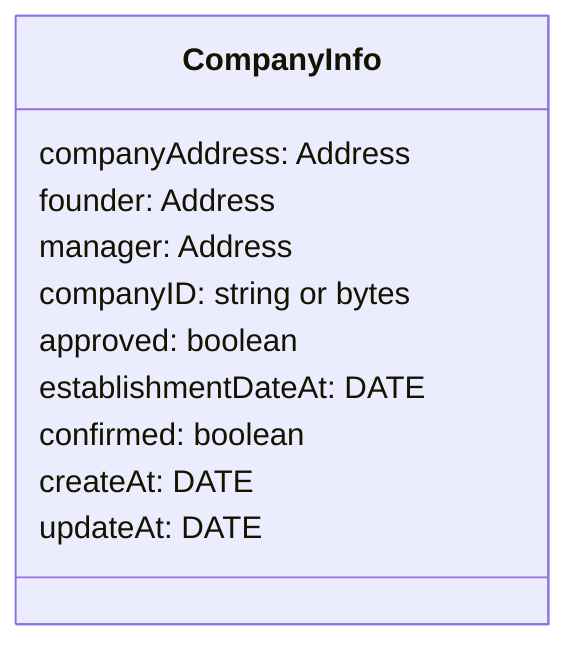
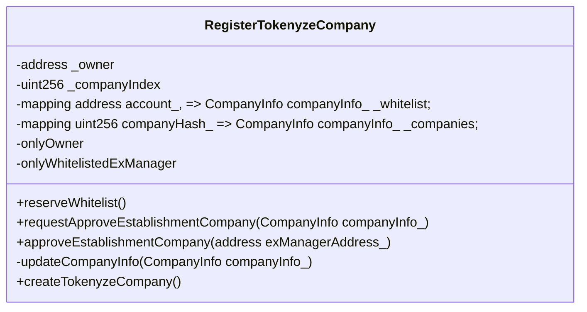
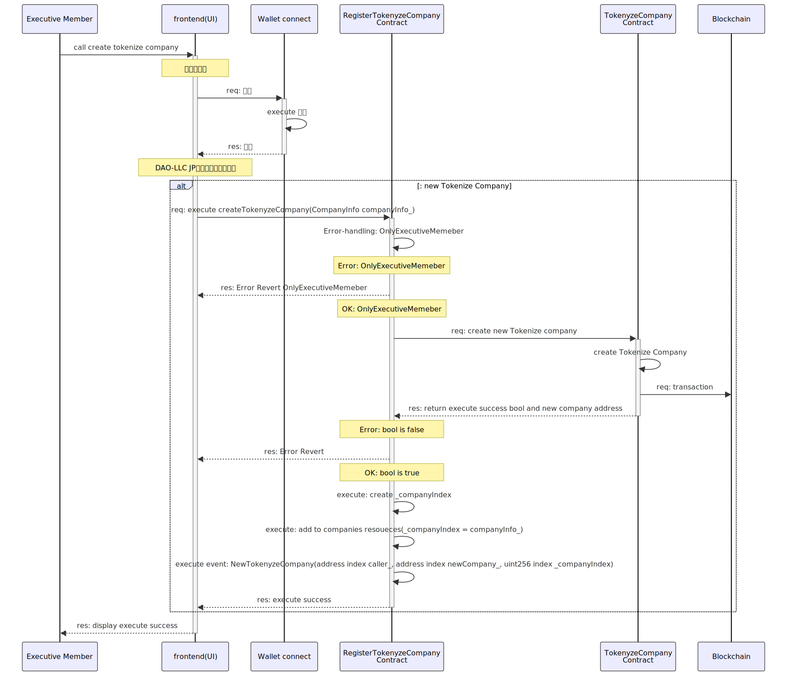

## Overview

- 登記済みの業務執行社員（代表社員）により、合同会社型 DAO（DAO-LLC-JP）`Tokenize company`を起動するコントラクトのドキュメントです。

1. `Contracts` 対象となるコントラクトを記載します
2. `Diagrams` シーケンス図など記載をします
3. `Issue` 課題について記載をします
4. `Others` その他の内容を記載します

---

## Contracts

1. RegisterTokenyzeCompany.sol
2. TokenyzeCompany.sol

---

## Diagrams

1. Data structure
2. Class
3. Sequence

---

### 1. Data structure



---

### 2. Class



---

### 3. Sequences

1. createTokenyzeCompany feature

---

#### 1. createTokenyzeCompany feature

- feature

```solidity
function createTokenyzeCompany(CompanyInfo info_) external returns(bool, address)
```

---

- Access control

1. `Executive member` 業務執行社員（代表社員）

---

- Error handling

1. `OnlyExecutiveMemeber` 業務執行社員（代表社員）のアドレスのみが実行できること
2. `RegisterTokenyzeCompany: Error NotCreateNewCompany` 設立に失敗した場合はリバートすること

---

- Event handling

1. `NewTokenyzeCompany(address index caller_, address index newCompany_, uint256 index _companyIndex)` 新規の合同会社 DAO(DAP-LLC-JP)の起動・設立イベントを発行する

---

<!-- sequence diagram作成用 -->



<details>
<summary>mermaid code</summary>
    ```mermaid
        sequenceDiagram
            participant EM as Executive Member
            participant UI as frontend(UI)
            participant WC as Wallet connect
            participant RTC as RegisterTokenyzeCompany<br/>Contract
            participant TC as TokenyzeCompany<br/>Contract
            participant BC as Blockchain

            EM ->>+ UI: call create tokenize company
            Note over UI: 署名の実行
            UI ->>+ WC: req: 署名
            WC ->> WC: execute 署名
            WC -->>- UI: res: 承認
            Note over UI: DAO-LLC JP起動（設立）の実行
            alt: new Tokenize Company
            UI ->>+ RTC: req: execute createTokenyzeCompany(CompanyInfo companyInfo_)
            RTC ->> RTC: Error-handling: OnlyExecutiveMemeber
            Note over RTC: Error: OnlyExecutiveMemeber
            RTC -->> UI: res: Error Revert OnlyExecutiveMemeber
            Note over RTC: OK: OnlyExecutiveMemeber
            RTC ->>+ TC: req: create new Tokenize company
            TC ->> TC: create Tokenize Company
            TC ->> BC: req: transaction
            TC -->>- RTC: res: return execute success bool and new company address
            Note over RTC: Error: bool is false
            RTC -->> UI: res: Error Revert
            Note over RTC: OK: bool is true
            RTC ->> RTC: execute: create _companyIndex
            RTC ->> RTC: execute: add to companies resoueces(_companyIndex = companyInfo_)
            RTC ->> RTC: execute event: NewTokenyzeCompany(address index caller_, address index newCompany_, uint256 index _companyIndex)
            RTC -->>- UI: res: execute success
            end
            UI -->>- EM: res: display execute success
    ```

</details>

---

## Issue

## Others

- Mermaid の SVG 変換

````

docker pull minlag/mermaid-cli:latest
docker run -it --rm -u "${UID}:${GID}" -v ${PWD}:/data minlag/mermaid-cli:latest -i /data/1.RegisterTokenyzeCompany.index.md

```

```
````
