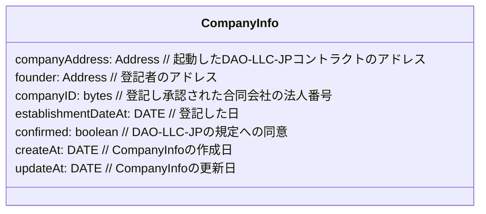
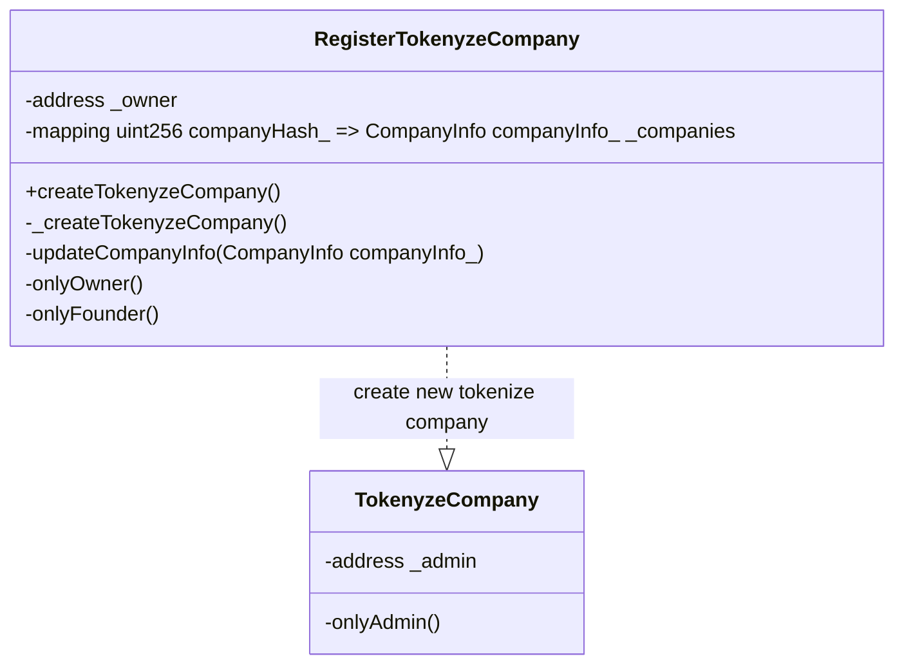

## Overview

- 登記済みの業務執行社員（代表社員）により、`登記した合同会社の各リソース登録`と`運営規定への同意`を行い、合同会社型 DAO（DAO-LLC-JP）`Tokenize companyを起動する`コントラクトのドキュメントです。

1. `Contracts` 対象となるコントラクトを記載します
2. `Diagrams` シーケンス図など記載をします
3. `Issue` 課題について記載をします
4. `Others` その他の内容を記載します

---

## Contracts

1. RegisterTokenyzeCompany.sol
2. TokenyzeCompany.sol // 起動される `DAO-LLC-JP の機能を持つ`コントラクト

---

## Diagrams

1. Data structure
2. Class
3. Sequence

---

### 1. Data structure



---

### 2. Class



---

### 3. Sequences

1. createTokenyzeCompany feature

---

#### 1. createTokenyzeCompany feature

- features

```solidity
function createTokenyzeCompany(bytes companyID_, uint256 establishmentDateAt_, bool confirmed_) external returns(bool, address);
function _createTokenyzeCompany(CompanyInfo info_) internal onlyFounder returns(bool, address);
function _updateCompanyInfo(CompanyInfo info_) internal onlyFounder returns(bool);
```

---

- Access control

1. `founder` 登記者・業務執行社員（代表社員）
2. `OnlyFounder` 登記者・業務執行社員（代表社員）のアドレスのみが実行できること

---

- Error handling

1. `Error: Register/Invalid-CompanyInfo` 会社リソースの異常時にリバートする
2. `Error: Register/OnlyFounder` 呼び出し者が登記者・業務執行社員（代表社員）のアドレスでない時はリバートする
3. `Error: Register/Not-Create-NewCompany` 設立に失敗した時はリバートする

---

- Event handling

1. `NewTokenyzeCompany(address index caller_, address index newCompany_, uint256 index _companyIndex)` 新規の合同会社 DAO(DAP-LLC-JP)の起動・設立イベントを発行する

---

<!-- sequence diagram作成用 -->


<details>
<summary>mermaid code</summary>
    ```mermaid
        sequenceDiagram
            participant EM as Executive Member
            participant UI as frontend(UI)
            participant WC as Wallet connect
            participant RTC as RegisterTokenyzeCompany<br/>Contract
            participant TC as TokenyzeCompany<br/>Contract
            participant BC as Blockchain

            EM ->>+ UI: call create tokenize company
            Note over UI: 署名の実行
            UI ->>+ WC: req: 署名
            WC ->> WC: execute 署名
            WC -->>- UI: res: 承認
            Note over UI: DAO-LLC JP起動（設立）の実行
            alt: new Tokenize Company
            UI ->>+ RTC: req: execute createTokenyzeCompany(CompanyInfo companyInfo_)
            RTC ->> RTC: Error-handling: Register/Invalid-CompanyInfo
            Note over RTC: Error: Register/Invalid-CompanyInfo
            RTC -->> UI: res: Error Revert Register/Invalid-CompanyInfo
            Note over RTC: OK: Register/Invalid-CompanyInfo
            RTC ->> RTC: Error-handling: Register/OnlyFounder
            Note over RTC: Error: OnlyFounder
            RTC -->> UI: res: Error Revert OnlyFounder
            Note over RTC: OK: OnlyFounder
            RTC ->>+ TC: req: _createTokenyzeCompany call
            TC ->> TC: create Tokenize Company
            TC ->> BC: req: transaction
            TC -->>- RTC: res: return execute success bool and new company address
            Note over RTC: Error: bool is false
            RTC -->> UI: res: Error Revert
            Note over RTC: OK: bool is true
            RTC ->> RTC: execute: create _companyIndex
            RTC ->> RTC: execute: add to companies resoueces(_companyIndex = companyInfo_)
            RTC ->> RTC: execute event: NewTokenyzeCompany(address index caller_, address index newCompany_, uint256 index _companyIndex)
            RTC -->>- UI: res: execute success
            end
            UI -->>- EM: res: display execute success
    ```

</details>

---

## Issue

## Others

- Mermaid の SVG 変換

```

docker pull minlag/mermaid-cli:latest
docker run -it --rm -u "${UID}:${GID}" -v ${PWD}:/data minlag/mermaid-cli:latest -i /data/1.RegisterTokenyzeCompany.index.md

```
