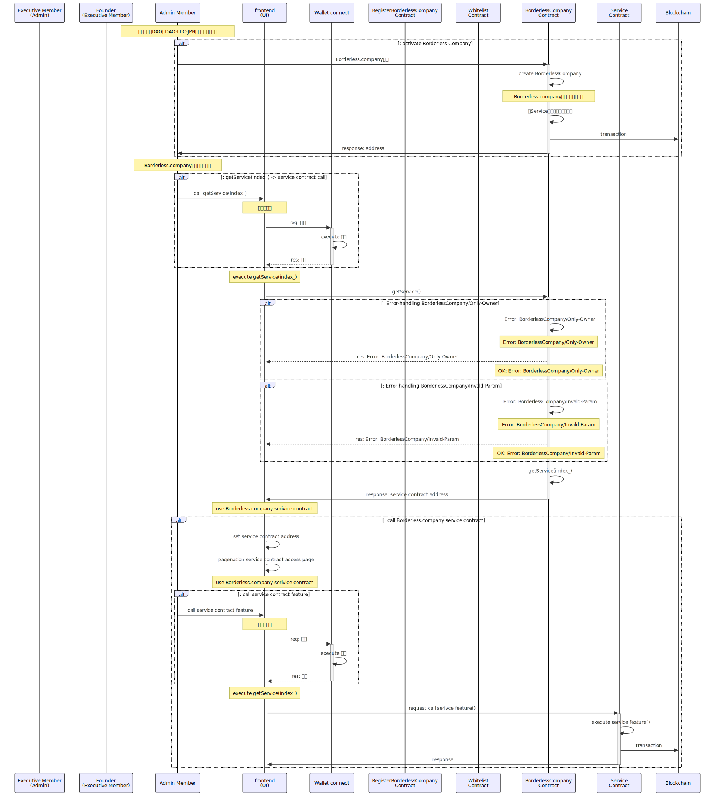

## Overview

- セットアップより起動（設立）される、`BorderlessCompany`コントラクトのドキュメントです。

---

## Summary

1. `Contracts` 対象となるコントラクトを記載します
2. `Diagrams` シーケンス図など記載をします
3. `Issue` 課題について記載をします
4. `Others` その他の内容を記載します

## 1. Contracts

- BorderlessCompany.sol

1. BorderlessCompany の管理・運営（オペレーションマネージャー）機能を提供する
2. `業務執行社員・代表社員`（利用者）に、セットアップされたサービスコントラクト機能との接続を提供する

## 1.Diagrams

1. Data structure
2. Interfaces
3. Sequence

---

### 1-1. Data structure

1. `_admin` BorderlessCompany を起動（設立）した業務執行社員・代表社員
2. `_register` BorderlessCompany を起動（設立）するためのセットアップアドレス
3. `_admins` ロールを付与された`業務執行社員・代表社員`達（リスト）
4. `_members` ロールを付与された`非業務執行社員・社員`達（リスト）
5. `_services`セットアップされているサービス機能群（リスト）

```solidity
address private _register;
mapping(address account_ => bool isAdmin_) private _admins; // TODO: ロール管理（Access control）の課題検討
mapping(address account_ => bool isMember_) private _members; // TODO: ロール管理（Access control）の課題検討
mapping(uint256 index_ => address service_) private _services;
```

internal
Manage/operation

external
token-holder/non-token-holder

---

### 1-2. Interfaces

- Actor
  1. `Admin` は、コントラクトを起動した`設立者`（業務執行社員・代表社員）
  2. および`Admin`は、`設立者`により権限を付与された、業務執行社員・代表社員
  3. `Member` は、`Admin`により権限を付与された、非業務執行社員（社員）
  4. `register` は、`BorderlessCompany` 起動（設立）するためのセットアップコントラクト
  5. Smart contract
     1. `BorderlessCompany` 起動（設立）した Borderless.company サービスの管理・運営を提供するコントラクト

---

- interface

1. 起動した`Borderless.company`にサービスの初期セットアップができる機能
2. `Borderless.company`の管理・運営をする機能（Operation・Manager）
3. `ロール付与`を管理できる機能 // TODO: ロール管理（Access control）の課題検討
4. セットアップされた`各Serviceコントラクト`のアドレスを参照できる機能
5. セットアップされた`各Serviceコントラクト`への管理操作できる機能

```solidity
/// @title feature interface for BorderlessCompny contract
interface ISCT { // Note: IBorderlessCompny is an feature interface
    /**
    * @dev サービスの初期設定を行います。
    * @notice Registerからのみ実行できます。
    * - onlyRegister モディファイアを使用して、オーナーのみがこの関数を呼び出せるようにします。
    * @param services_ 初期設定するサービスのアドレス配列です。
    * @return completed_ 初期設定するサービスのアドレスが設定されたかどうかのブール値です。
    */
    function initialService(address[] memory services_) external returns(bool completed_);

    /**
    * @dev サービスを追加します。
    * @param index_ 追加するサービスのインデックスです。
    * @return service_ 追加されたサービスのアドレスです。
    */
    function addService(uint256 index_) external returns(address service_);

    /**
    * @dev サービスを削除します。
    * @param index_ 削除するサービスのインデックスです。
    * @return service_ 削除されたサービスのアドレスです。
    */
    function removeService(uint256 index_) external returns(address service_);

    /**
    * @dev 指定されたインデックスのサービスを取得します。
    * @param index_ サービスのインデックスです。
    * @return service_ 指定されたインデックスのサービスのアドレスです。
    */
    function getService(uint256 index_) external returns(address service_);

    /**
    * @dev アカウントに役割を割り当てます。
    * @param account_ 役割を割り当てるアカウントのアドレスです。
    * @param isAdmin_ 管理者権限を割り当てるかどうかを示すブール値です。
    * @return assigned_ 役割の割り当てが完了したかを示すブール値です。
    */
    function assignmentRole(address account_, bool isAdmin_) external returns(bool assigned_);

    /**
    * @dev アカウントの役割を解除します。
    * @param account_ 役割を解除するアカウントのアドレスです。
    * @param isAdmin_ 管理者権限を解除するかどうかを示すブール値です。
    * @return released_ 役割の解除が完了したかを示すブール値です。
    */
    function releaseRole(address account_, bool isAdmin_) external returns(bool released_);
}
```

---

- Event-handling

1. サービスの初期セットアップのイベンツ通知
2. `Admin（業務執行社員・代表社員）`ロールの割り当てイベント通知
3. `Member（非業務執行社員・社員）`ロールの割り当てイベント通知

```solidity

interface EventSCT {
  /**
  * @dev サービスの初期設定が完了したことを通知するイベントです。
  * @param company_ サービスの初期設定を行った企業のアドレスです。
  * @param governance_ サービスの初期設定に関連するガバナンスのアドレスです。
  * @param treasury_ サービスの初期設定に関連するトレジャリーのアドレスです。
  * @param token_ サービスの初期設定に関連するトークンのアドレスです。
  */
  event InitialService(address indexed company_, address governance_, address treasury_, address token_);

  /**
  * @dev サービスが追加されたことを通知するイベントです。
  * @param service_ 追加されたサービスのアドレスです。
  * @param index_ 追加されたサービスのインデックスです。
  */
  event AddService(address indexed service_, uint256 indexed index_);

  /**
  * @dev サービスが削除されたことを通知するイベントです。
  * @param service_ 削除されたサービスのアドレスです。
  * @param index_ 削除されたサービスのインデックスです。
  */
  event RemoveService(address indexed service_, uint256 indexed index_);

  /**
  * @dev 管理者の役割が割り当てられたことを通知するイベントです。
  * @param admin_ 役割が割り当てられた管理者のアドレスです。
  */
  event AssignmentRoleAdmin(address indexed admin_);

  /**
  * @dev メンバーの役割が割り当てられたことを通知するイベントです。
  * @param member_ 役割が割り当てられたメンバーのアドレスです。
  */
  event AssignmentRoleMember(address indexed member_);

  /**
  * @dev 管理者の役割が解除されたことを通知するイベントです。
  * @param admin_ 役割が解除された管理者のアドレスです。
  */
  event ReleaseRoleAdmin(address indexed admin_);

  /**
  * @dev メンバーの役割が解除されたことを通知するイベントです。
  * @param member_ 役割が解除されたメンバーのアドレスです。
  */
  event ReleaseRoleMember(address indexed member_);
}
```

---

- Error-handling

1. `Error: BorderlessCompany/Invalid-Address` 不正なアドレスパラメータのリバート
2. `"Error: BorderlessComapny/Invalid-Index"` `getService(index_)`で不正なインデックスパラメータのリバート
3. `Error: BorderlessCompany/Already-Initial-Service` 初期設定済み機能の不正設定リバート
4. `Error: BorderlessCompany/Already-Assignment-Role` 既にロール付与していることのリバート
5. `Error: BorderlessCompany/Already-Release-Role` 既にロール付与者ではないことのリバート
6. `Error: BorderlessCompany/Only-Admin` `Admin`以外の不正な呼び出し者のリバート
7. `Error: BorderlessCompany/Only-Register` `Register`以外の不正な呼び出し者のリバート（初期セットアップで使用する）

```solidity
/// @title Error interface for BorderlessCompany
interface ErrorSCT {
  // -- 1. 不正なアドレスパラメータのリバート -- //
  /**
  * @dev アカウントが無効であることを通知するエラーです。
  * @param account_ エラーが発生したアカウントのアドレスです。
  */
  error InvalidAddress(address account_);

  // -- 2. 不正なIndexパラメータのリバート -- //
  /**
  * @dev インデックスが無効であることを通知するエラーです。
  * @param index_ エラーが発生したインデックスです。
  */
  error InvalidIndex(uint256 index_);

  // -- 3. 初期設定済み機能の不正設定リバート -- //
  /**
  * @dev 初期設定済みの機能がすでに設定されていることを通知するエラーです。
  * @param account_ エラーが発生したアカウントのアドレスです。
  */
  error AlreadyInitialService(address account_);

  // -- 4. 既にロール付与していることのリバート -- //
  /**
  * @dev アカウントに既にロールが割り当てられていることを通知するエラーです。
  * @param account_ エラーが発生したアカウントのアドレスです。
  */
  error AlreadyAssignmentRole(address account_);

  // -- 5. 既にロール付与者ではないことのリバート -- //
  /**
  * @dev アカウントが既にロールの解除を受けていることを通知するエラーです。
  * @param account_ エラーが発生したアカウントのアドレスです。
  */
  error AlreadyReleaseRole(address account_);
}

// -- 5. `Admin`以外の不正な呼び出し者のリバート -- //
modifier onlyAdmin() {
    require(_admins[msg.sender], "Error: BorderlessCompany/Only-Admin");
    _;
}

// -- 6. `Register`以外の不正な呼び出し者のリバート（初期セットアップで使用する） -- //
modifier onlyRegister() {
    require(msg.sender == _register, "Error: BorderlessCompany/Only-Register");
    _;
}
```

---

### 3. Sequences

- BorderlessCompany サービスの`初期立ち上げ`は、FactoryPool に記載しています。それ以外に関しての sequence を記載します。

1. `Borderless.company`で利用できるサービス機能へのアクセス
2. `Admin(業務執行社員・代表社員)`の登録・削除
3. `Member(非業務執行社員・代表社員)`の登録・削除
4. `Borderless.company`で利用できるサービスの追加・削除の機能 // Note: こちら検討中です

---

#### 3-1. `Borderless.company`で利用できるサービス機能へのアクセス



<details>
<summary>mermaid code</summary>
    ```mermaid
        sequenceDiagram
            participant AD as Admin Member
            participant UI as frontend<br/>(UI)
            participant WC as Wallet connect
            participant RTC as RegisterBorderlessCompany<br/>Contract
            participant BLC as BorderlessCompany<br/>Contract
            participant SC as Service<br/>Contract
            participant BC as Blockchain

            Note over AD: 合同会社型DAO（DAO-LLC-JPN）のセットアップ
            alt: activate Borderless Company
            AD ->>+ BLC: Borderless.company起動
            BLC ->> BLC: create BorderlessCompany
            Note over BLC: Borderless.company初期セットアップ
            BLC ->> BLC: 各Serviceの初期セットアップ
            BLC ->> BC: transaction
            BLC ->>- AD: response: address
            end

            Note over AD: Borderless.companyサービスの利用
            alt: getService(index_) -> service contract call
            AD ->>+ UI: call getService(index_)
            Note over UI: 署名の実行
            UI ->>+ WC: req: 署名
            WC ->> WC: execute 署名
            WC -->>- UI: res: 承認
            end
            Note over UI: execute getService(index_)
            UI ->>+ BLC: getService()

            alt: Error-handling BorderlessCompany/Only-Owner
            BLC ->> BLC: Error: BorderlessCompany/Only-Owner
            Note over BLC: Error: BorderlessCompany/Only-Owner
            BLC -->> UI: res: Error: BorderlessCompany/Only-Owner
            Note over BLC: OK: Error: BorderlessCompany/Only-Owner
            end

            alt: Error-handling BorderlessCompany/Invald-Param
            BLC ->> BLC: Error: BorderlessCompany/Invald-Param
            Note over BLC: Error: BorderlessCompany/Invald-Param
            BLC -->> UI: res: Error: BorderlessCompany/Invald-Param
            Note over BLC: OK: Error: BorderlessCompany/Invald-Param
            end

            BLC ->> BLC: getService(index_)
            BLC ->>- UI: response: service contract address

            Note over UI: use Borderless.company serivice contract
            alt: call Borderless.company service contract
            UI ->> UI: set service contract address
            UI ->> UI: pagenation service contract access page

            Note over UI: use Borderless.company serivice contract
            alt: call service contract feature
            AD ->>+ UI: call service contract feature
            Note over UI: 署名の実行
            UI ->>+ WC: req: 署名
            WC ->> WC: execute 署名
            WC -->>- UI: res: 承認
            end
            Note over UI: execute getService(index_)
            UI ->>+ SC: request call serivce feature()
            SC ->> SC: execute service feature()
            SC ->> BC: transaction
            SC ->>- UI: response
            end
    ```

</details>

---

## Issue

- Access control の検討・開発
  - `Admin`, `Member`はじめロール管理のコントラクト導入を検討する必要性がある
- サービス機能の追加・削除
  - 追加するための仕組みの検討をする必要性がある

---

## Others

- Mermaid の SVG 変換

```linux
docker pull minlag/mermaid-cli:latest
docker run -it --rm -u "${UID}:${GID}" -v ${PWD}:/data minlag/mermaid-cli:latest -i /data/0.BorderlessCompany.index.md
```
