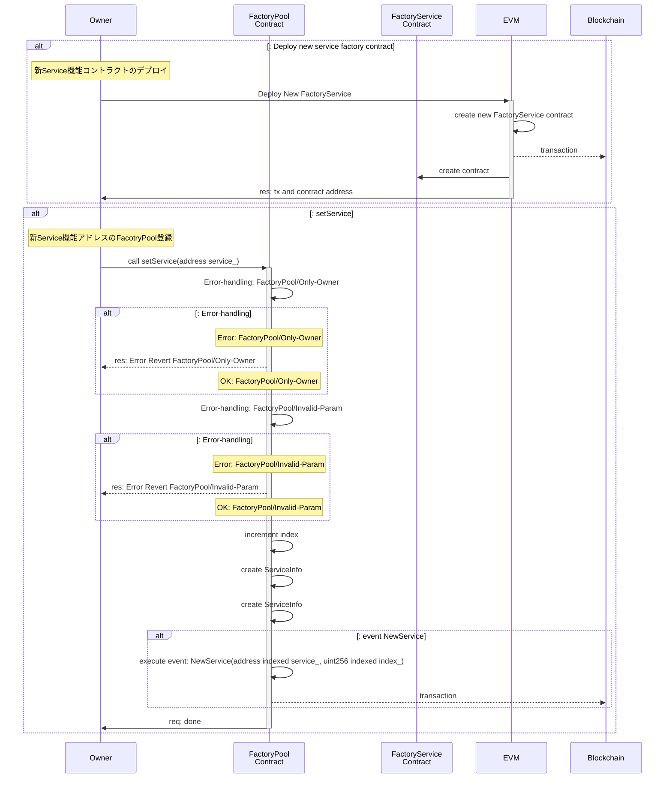
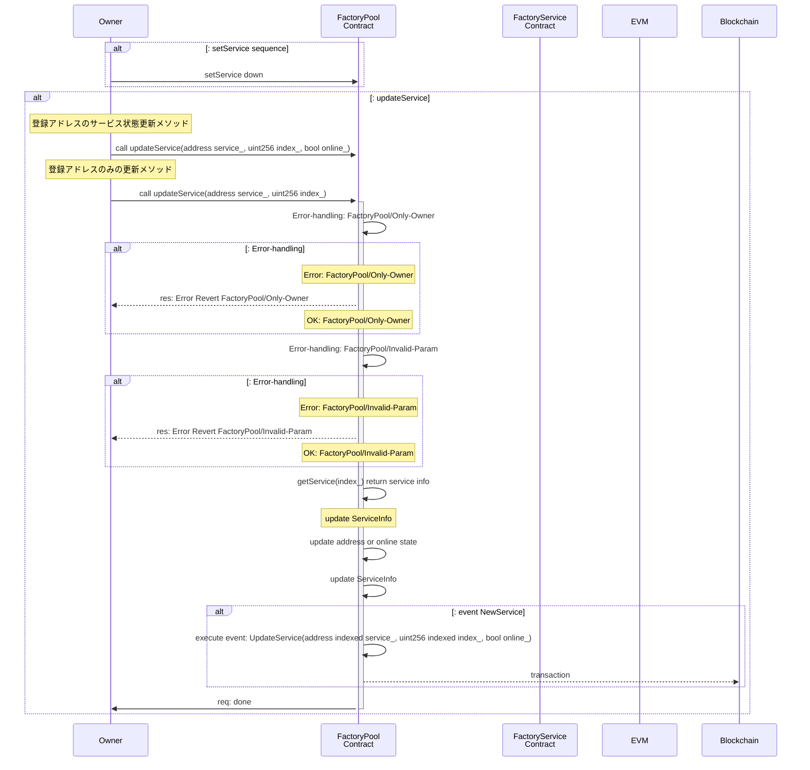
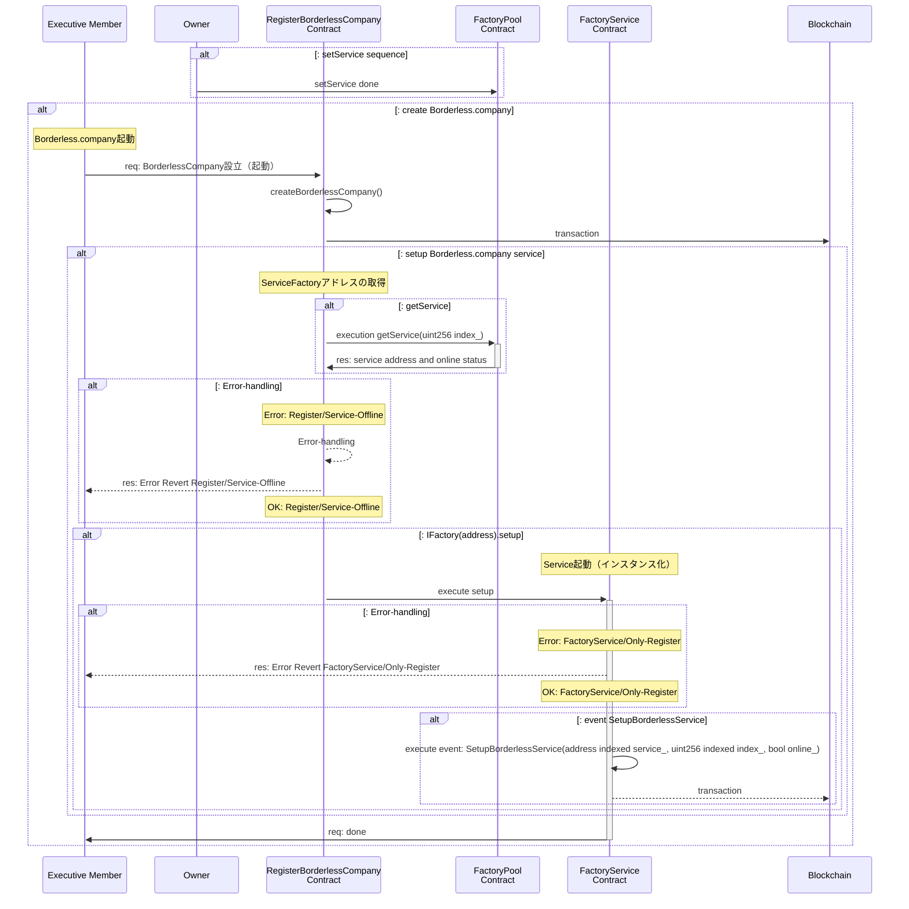

# Factory Pool

## Overview

- Borderless.company サービスの Factory Pool に関するドキュメントです

---

## Summary

---

## Step

- `Service`のデプロイフロー
- Borderless.company のメンテナー `Admin`が実行する

1. `OverlayAG Admin` オペレーションによるデプロイ（サービス提供者）
   1. 提供する`Service機能群のFactoryコントラクト`のデプロイ
2. `業務執行社員・代表社員` オペレーションによるデプロイ（サービス利用者）
   1. 業務執行社員・代表社員が、createBorderless を実行する時に、1 が呼び出される

---

### Operations memo

- 主には、`1-Ⅱ-1`の "FactoryPool の機能責務"、`1-Ⅴ`の"登録"、`2-Ⅳ`の "Service 起動"が主なオペレーションになります。

1. `OverlayAG Admin` オペレーションによるデプロイ（サービス提供者）
   1. `Whitelist`コントラクトのデプロイ
      1. `Whitelist`は、`業務執行社員・代表社員`のホワイトリスト管理と、その登録機能を有する
   2. `FactoryPool`コントラクトのデプロイする。
      1. `FactoryPool`は、`各Serviceリリース用のFacotry`の ID・アドレス管理と、その登録機能を有する
   3. `Register`コントラクトのデプロイし、その時に、`Whitelist`, `FactoryPool`コントラクトのアドレスを登録する。
   4. `各Serviceリリース用のFacotry`コントラクトをデプロイし、その時に、`Register`コントラクトのアドレスを登録する。
   5. `FactoryPool`コントラクトへデプロイした、`各Serviceリリース用のFacotry`コントラクトのアドレスを登録する。
      1. `Register`コントラクトで、`createBorderlessCompany`機能をコールする時にアドレスを参照する。
2. `業務執行社員・代表社員` オペレーションによるデプロイ（サービス利用者）
   1. `Register`コントラクトで、`createBorderlessCompany`を実行する。
   2. `BorderlessCompany`コントラクトが起動する。
   3. `FactoryPool`コントラクトより、`_services`を参照し`各Serviceリリース用のFacotry`コントラクトを実行する
   4. 3 をもとに`各Serviceリリース用のFacotry`コントラクトアドレスを指定して、 `setup`により Service を起動する

---

## Common design

- Actor

1. `OverlayAG` Devloper(service provider)
2. `exMember` call `setup` from `Register`(RegisterBorderlessCompany) contract

---

### FactoryPool コントラクト　　 for Official

1. Data structure
2. Interfaces
3. Diagram

#### 1. Data structure

```solidity
struct ServiceInfo{
   address _service;
   bool _online;
}

address private _owner;
uint256 private _lastIndex;
mapping(uint256 index_ => ServiceInfo info_) _services;
```

---

#### 2. Interfaces

- interface

1. `ServiceコントラクトFactory`の登録をする機能
2. 登録した`ServiceコントラクトFactory`のアドレスを参照できる機能
3. 登録した`ServiceコントラクトFactory`のアドレスを更新できる機能
4. 登録した`ServiceコントラクトFactory`の提供状態を更新できる機能

```solidity
/// @title feature interface
interface IFactoryPool{
   function setService(address service_) external;
   function getService(uint256 index_) external returns(address service_, bool online_);
   function updateService(address service_, uint256 index_) external;
   function updateService(address service_, uint256 index_, bool online_) external;
}
```

---

- Event-handling

1. FactoryPool への新規 Service アドレス追加イベント
2. Service リソース（アドレス・状態）の更新イベント

```solidity
/// @title Event interface
interface EventFactoryPool {
   event NewService(address indexed service_, uint256 indexed index_);
   event UpdateService(address indexed service_, uint256 indexed index_, bool online_);
}
```

---

- Error-handling

```solidity
/// @title Error interface
interface ErrorFactoryPool {
   error InvalidParam(address service_, uint256 index_, bool online_);
}

modifier onlyOwner() {
    require(msg.sender == _register, "FactoryPool: Only-Owner");
    _;
}
```

#### 3. Diagram

- `setService` sequence



---

- `updateService` sequence



---

- `getService` sequence



---

### FacotryService コントラクトの Common（共通）設計

- Common interface

```solidity
/// @title common interface for factory service
interface IFactoryService {
    function setup(address admin_, address company_, uint256 serviceID_) external returns (address service_);
}

// Event-handling
/// @title common interface for factory service
interface EventFactoryService {
    event SetupBorderlessService(address indexed admin_, address indexed service, uint256 indexed serviceID);
}

// Error-handling
modifier onlyRegister() {
    require(msg.sender == _register, "FactoryService: Only-Register");
    _;
}
```

---

- FacotryService template

```solidity
/// @title Test factory smart contract for Borderless.company service
contract FactorySampleService is IFactoryService, EventFactoryService {
    address private _owner;
    address private _register;

    constructor(address register_) {
        _owner = msg.sender;
        _register = register_;
    }

    event SetupBorderlessService(address indexed admin_, address indexed service, uint256 indexed serviceID);

    function setup(address admin_, address company_, uint256 serviceID_) external override onlyRegister returns (address service_) {
        /// Note: common service setup
        SampleService service = new SampleService(admin_, company_); // Note: **この箇所を変更する**

        emit SetupBorderlessService(admin_, address(service), serviceID_);

        service_ = address(service);
    }

    modifier onlyRegister() {
        require(msg.sender == _register, "FactoryService: Only-Register");
        _;
    }
}
```

---

## Diagrams

---

### flowchart

1. `OverlayAG Admin` オペレーションによるデプロイ（サービス提供者）
   1. `Whitelist`コントラクトのデプロイ
      1. `Whitelist`は、`業務執行社員・代表社員`のホワイトリスト管理と、その登録機能を有する
   2. `FactoryPool`コントラクトのデプロイする。
      1. `FactoryPool`は、`各Serviceリリース用のFacotry`の ID・アドレス管理と、その登録機能を有する
   3. `Register`コントラクトのデプロイし、その時に、`Whitelist`, `FactoryPool`コントラクトのアドレスを登録する。
   4. `各Serviceリリース用のFacotry`コントラクトをデプロイし、その時に、`Register`コントラクトのアドレスを登録する。
   5. `FactoryPool`コントラクトへデプロイした、`各Serviceリリース用のFacotry`コントラクトのアドレスを登録する。
      1. `Register`コントラクトで、`createBorderlessCompany`機能をコールする時にアドレスを参照する。
2. `業務執行社員・代表社員` オペレーションによるデプロイ（サービス利用者）
   1. `Register`コントラクトで、`createBorderlessCompany`を実行する。
   2. `BorderlessCompany`コントラクトが起動する。
   3. `FactoryPool`コントラクトより、`_services`を参照し`各Serviceリリース用のFacotry`コントラクトを実行する
   4. 3 をもとに`各Serviceリリース用のFacotry`コントラクトアドレスを指定して、 `setup`により Service を起動する

---

### sequence
